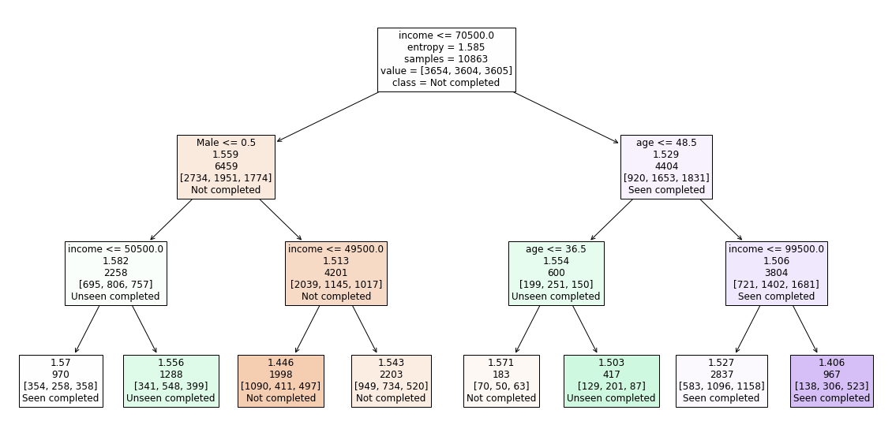

# Udacity Starbucks Capstone

## Motivation for the project

The aim of this analysis as part of the Udacity Data Science Nanodegree was to find out if it possible to identify a Starbucks user group that profits from discounts without the knowledge of it.

## Summary of the results

In the [analysis](https://nbviewer.jupyter.org/github/whamer/Udacity_Data_Science_Capstone/blob/main/Udacity_Starbucks_Capstone.ipynb) it was possible to identify such a group consisting of users between 37 and 48 years of age with an income above 70,500 $. 

## Libraries used

The following python libraries are used in this project:

- pandas 
- numpy 
- math
- json
- plotly.express 
- matplotlib.pyplot 
- sklearn 
- sklearn.metrics
- sklearn.model_selection

## Files in the repository

- Udacity_Starbucks_Capstone.ipynb 
                   
      Jupyter Notebook with the data processing and modelling

- ./data/portfolio.json 
                   
      Containing data about the offers of Starbucks including offer_type (type of offer ie BOGO, discount, informational), difficulty (minimum required spend to complete an offer), reward (reward given for completing an offer), duration (time for offer to be open, in days) and the channels of the offer (web, mail, ...).

- ./data/profile.json
                   
      Containing data about the customers of Starbucks including age ,gender, customer id and the customer's income.

- ./data/transcript.json
                   
      Containing data about the offers the customers of Starbucks got and how they interacted with it including event (ie transaction, offer received, offer viewed, etc.), customer id, time (time in hours since start of test and the value - (either an offer id or transaction amount depending on the record).

- ./img/decision_tree.png
                   
      Final decision tree depicted above
     
## Additional links

You can also read the description of this study in the [Medium story](https://wolfhamer.medium.com/starbucks-rewards-pogram-analysis-udacity-capstone-project-5f9061755ae).

